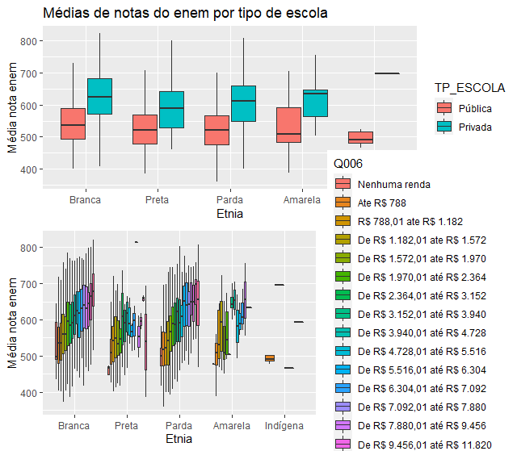
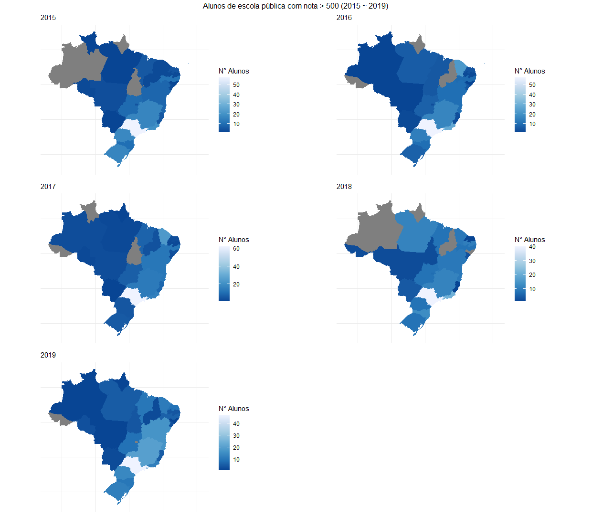

# Análise dataset ENEM

Análise de dados do ENEM dos anos 2015 a 2019. O objetivo da análise foi verificar de forma reduzida como está a desigualdade no Brasil, verificando o quanto difere em relação a Etnia, Renda, Escolaridade dos pais e Tipo de escola. Como foi feita uma redução dos dados, pode haver uma má representação da situação do país como um todo e também pode existir um viés por conta do método de seleção dos indivíduos.

Fonte: https://www.gov.br/inep/pt-br/acesso-a-informacao/dados-abertos/microdados/enem
 
## Colunas separadas no dataset:

Marcados com (*) foram usados no script. O dataset é uma redução do dataset original, foi separado 500 indivíduos por tipo de escola ("Não respondeu", "Pública" e "Privada") para cada ano, totalizando 7500 indivíduos. 

* NU_INSCRICAO: Número de inscrição
* (*) NU_ANO: Ano do Enem
* (*) NO_MUNICIPIO_RESIDENCIA: Nome do município de residência
* CO_UF_RESIDENCIA: Código da Unidade da Federação de residência
* (*) SG_UF_RESIDENCIA: Sigla da Unidade da Federação de * residência
* TP_DEPENDENCIA_ADM_ESC: Dependência administrativa (Escola)
* TP_LOCALIZACAO_ESC: Localização (Escola)
* TP_SIT_FUNC_ESC: Situação de funcionamento (Escola)
* (*) NU_IDADE: Idade
* (*) TP_SEXO: Sexo
CO_MUNICIPIO_NASCIMENTO: Código do município de nascimento(1º dígito: Região;1º e 2º dígitos: UF;3º, 4º, 5º e 6º dígitos: Município;7º dígito: dígito verificador)
* (*) TP_ESCOLA: Tipo de escola do Ensino Médio
* TP_ENSINO: Tipo de instituição que concluiu ou concluirá o Ensino Médio
* TP_ESTADO_CIVIL: Estado Civil
* (*) TP_COR_RACA: Cor/raça
* (*) NU_NOTA_CN: Nota da prova de Ciências da Natureza
* (*) NU_NOTA_CH: Nota da prova de Ciências Humanas
* (*) NU_NOTA_LC: Nota da prova de Linguagens e Códigos
* (*) NU_NOTA_MT: Nota da prova de Matemática
* TP_STATUS_REDACAO: Situação da redação do participante
* (*) NU_NOTA_REDACAO: Nota da prova de redação
* (*) Q001: Até que série seu pai, ou o homem responsável por você, estudou?
* (*) Q002: Até que série sua mãe, ou a mulher responsável por você, estudou?
* (*) Q005: Incluindo você, quantas pessoas moram atualmente em sua residência?
* (*) Q006: Qual é a renda mensal de sua família? (Some a sua renda com a dos seus familiares.

## Alguns resultados interessantes: 

Resumindo o que foi encontrado, no decorrer dos anos não existe uma melhora das notas dos alunos, dado que foi suportado pelo teste estatístico de Kruskall-Wallis, aceitando a hipotese que não existe diferença significativa entre as médias (p-value > 0.05 - 0.1424). Também foi feito o teste entre alunos de escola pública, separando entre alunos que possuem ambos os pais não formados ou formados sem ensino superior e os alunos de escola pública que possuem ambos os pais com escolaridade alta (Tendo iniciado ou finalizado o ensino superior), a partir do teste estatístico de Wilcox, mostrou-se que existe uma diferença significativa entre os dois grupos (p-value < 0.05 - 3.268e-16), mostrando o quão importante é a alfabetização e educação de qualidade para as famílias. Com isso foi possível verificar a desigualdade entre escola pública e privada, renda por família e escolaridade dos pais.

Outro ponto interessante é ao analisarmos as diferenças das médias por Etnia e Renda, os dados de renda para pessoas negras se tornam mais "randômicos" para as rendas maiores, isso pode ocorrer por alguns motivos, seja pela falta de dados ou por conta do número de pessoas negras que possuem uma família com renda alta ser reduzido, por conta da desigualdade racial.

Também verificamos como está o desenvolvimento dos alunos de escola pública ao longo dos anos. Contabilizamos os alunos que tiraram uma nota maior que 500 (média entre todos os cadernos) para cada estado. Com isso, nota-se uma melhoria, por mais que existe uma falta de dados, na quantidade de alunos com notas maiores desde o ano de 2015 a 2019.

Os resultados apresentados aqui foram um meio de treinar os conceitos aprendidos durante uma disciplina de pós-graduação e podem não condizer com a realizade do país, porém é interessante análisar estes pontos e visualizar o quanto as pautas sociais e políticas de redução de desigualdade são essênciais para o crescimento do país como um todo.